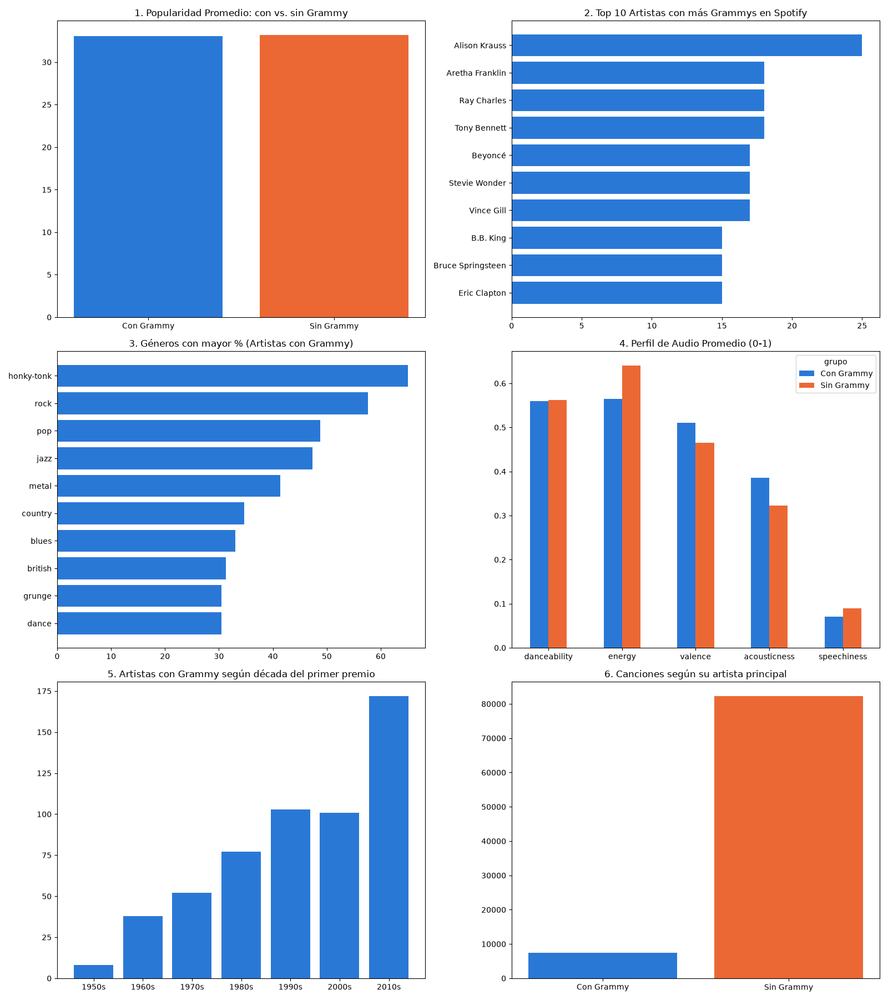
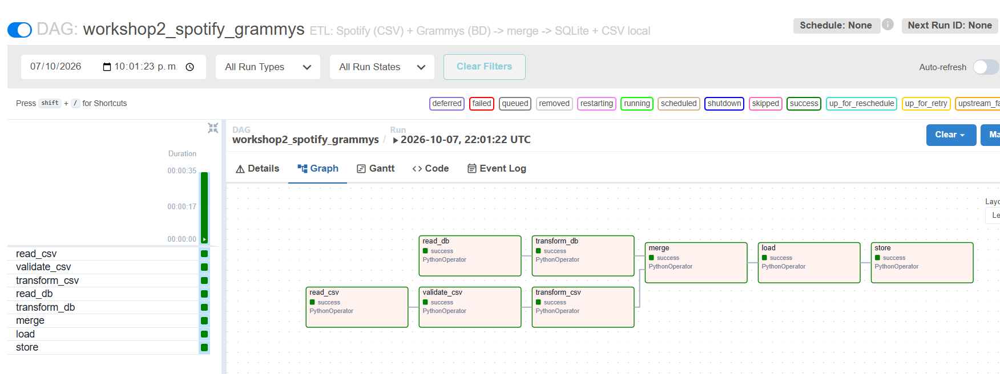

# Workshop 2: Pipeline ETL - Spotify & Grammys

Este proyecto automatiza un pipeline ETL con Apache Airflow para integrar datos de canciones de Spotify (desde un archivo CSV) con información de los Premios Grammy (desde una base de datos). El flujo valida la calidad de los datos con Pandera, limpia y realiza el cruce (merge) de ambas fuentes, y guarda el resultado en una base de datos analítica local (SQLite) para su posterior visualización.

## Arquitectura del Proyecto

El pipeline sigue un flujo de trabajo paralelo que luego se consolida:
1. **Rama CSV (Spotify):** Lectura del archivo, validación estricta de calidad de datos y limpieza.
2. **Rama DB (Grammys):** Extracción de datos de premiación y estandarización de nombres.
3. **Merge & Load:** Cruce de ambas fuentes y carga en `musica_destino.db` (SQLite).

## Estructura de Carpetas
* `dags/`: Contiene `dag_workshop2.py` con la orquestación en Airflow.
* `scripts/`: Scripts auxiliares de ETL y generación de reportes (`etl_funciones.py`, `02_reporte_dashboard.py`).
* `notebooks/`: Contiene `notebook_final.ipynb` con el análisis exploratorio paso a paso.
* `db/`: Bases de datos origen y destino.
* `data/`: Archivos CSV crudos y carpeta de reportes/output.
* `images/`: Capturas de evidencia de ejecución y dashboards.

## Validación de calidad de datos (Pandera)

Se valida el dataset de Spotify con un esquema que define:
- **Tipos de dato** de las 20 columnas.
- **Valores faltantes:** `nullable=False`.
- **Rangos:** `popularity` 0–100; `danceability`, `energy`, `speechiness`, `acousticness`, `instrumentalness`, `liveness` y `valence` 0–1; `key` −1 a 11; `loudness` −60 a 5; `tempo` 0–300; `time_signature` 0–7; `duration_ms` > 0; `mode` en {0, 1}.
- **Unicidad:** `track_id`.

La validación se hace en dos puntos:
1. **Datos crudos (`validate_csv`):** Con `lazy=True` se revisan todas las reglas y se genera un reporte con PASA/FALLA por regla. Si falla una regla estructural (columna ausente o tipo incorrecto), la tarea queda en rojo y el pipeline se detiene. Las fallas de contenido (nulos, duplicados, rangos) terminan como `PASA CON ADVERTENCIAS`, porque `transform_csv` las corrige.
2. **Datos limpios (`transform_csv`):** El esquema "limpio" funciona como puerta de calidad: cualquier falla detiene el pipeline y los datos malos no llegan a la base.

## Transformación, Merge y Carga

- **Transformación:** En Spotify, se eliminan duplicados por `track_id`, se imputan nulos básicos y se filtran valores fuera de rango. En Grammys, se normalizan los nombres de los artistas (minúsculas, sin espacios extra) para facilitar el cruce.
- **Merge:** Se realiza un cruce (Left Join) usando el nombre del artista como llave (`artist_key`). Se agrega la bandera `has_grammy` (1 o 0) y el total de premios ganados.
- **Carga:** El dataframe consolidado se inserta en la tabla `spotify_grammys` dentro de la base de datos SQLite `musica_destino.db` usando `to_sql`, reemplazando la tabla en cada ejecución.

## Decisiones Técnicas
* **SQLite:** Elegido como motor de base de datos destino por su ligereza y portabilidad, ideal para un proyecto académico sin requerimientos de alta concurrencia.
* **Pandera sobre Pandas nativo:** Implementado para garantizar un control estricto de tipos y reglas de dominio (contratos de datos) antes de permitir que los datos fluyan.
* **Separación lógica en Airflow:** Mantener la extracción y transformación de DB y CSV en ramas paralelas optimiza el tiempo de ejecución.

## Limitaciones
* **Cruce por nombre exacto:** El cruce entre artistas se hace mediante coincidencia de texto normalizado. Diferencias ortográficas menores o colaboraciones (ej. "Artista A feat. Artista B" vs "Artista A") pueden quedar por fuera del cruce.
* **Escalabilidad:** SQLite no es apto para escrituras concurrentes masivas. En un entorno productivo real, el destino debería ser un Data Warehouse (ej. PostgreSQL, Snowflake).

## Resultados

El pipeline integra la información de Spotify y los Premios Grammy,
generando un dataset consolidado para el análisis.

### Dashboard

A partir de los datos procesados se generan diferentes visualizaciones
sobre popularidad, artistas, géneros, características de audio y
distribución de canciones.



### Ejecución del pipeline en Airflow

El DAG `workshop2_spotify_grammys` permite orquestar las diferentes
etapas del proceso ETL. La siguiente imagen muestra una ejecución
exitosa del pipeline:



## Cómo ejecutarlo

### Requisitos

Antes de comenzar, asegúrate de tener instalado:

- Python 3.10+
- Docker Desktop
- Git

### 1. Clonar el repositorio

```
git clone https://github.com/andrescam2026/ETL_WORKSHOP_02.git

```

### 2. Verificar los datos

La carpeta `data/` debe contener los archivos necesarios para ejecutar el pipeline:

```text
data/
├── spotify_dataset.csv
└── the_grammy_awards.csv

```

### 3. Crear el entorno virtual

Crear un entorno virtual para instalar las dependencias del proyecto:
```
python -m venv .venv
```
Activar el entorno virtual:

Windows:
```
.venv\Scripts\activate
```
Linux / macOS:
```
source .venv/bin/activate
```
Instalar las dependencias:
```
pip install -r requirements-local.txt
```

### 4. Iniciar Airflow

Inicializar Apache Airflow:

```
docker compose up airflow-init
```

Una vez finalizada la inicialización, levantar los servicios:
```
docker compose up -d
```
### 5. Ejecutar el DAG

Abrir Apache Airflow desde el navegador:
```
http://localhost:8080
```
Credenciales de acceso:

```
Usuario: airflow
Contraseña: airflow
```

En la interfaz de Airflow:

Buscar el DAG workshop2_spotify_grammys.
Activar el DAG.
Seleccionar Trigger DAG para iniciar la ejecución.
Esperar a que todas las tareas finalicen correctamente.

### 6. Generar el dashboard

Una vez finalizada correctamente la ejecución del DAG, generar las visualizaciones mediante:

```
python scripts/02_reporte_dashboard.py
```

También es posible explorar el análisis de forma interactiva mediante el notebook:
```
notebooks/notebook_final.ipynb
```

### 7. Detener los servicios

Cuando hayas terminado de trabajar con el proyecto, puedes detener los servicios de Docker con:
```
docker compose down
```